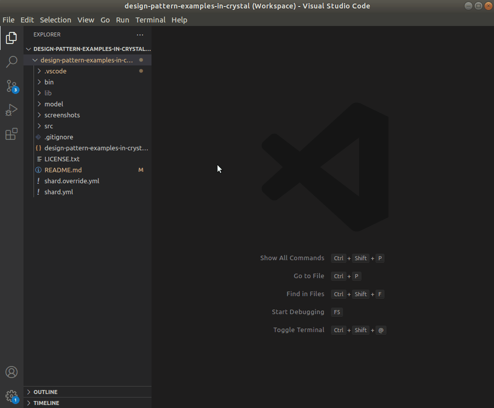

[](https://raw.githubusercontent.com/takaakit/design-pattern-examples-in-crystal/master/screenshots/DiagramMap.svg)

Design Pattern Examples in Crystal
===

Model and code examples of GoF Design Patterns for Crystal.  
This project is available for the following objectives:  

* To try Model-Driven Development (MDD) using Astah and M PLUS plug-in.
* To understand the mapping between UML model and Crystal code.
* To understand GoF Design Pattern examples in Crystal.  
  etc.

> UML model example:


<a id="code-example"></a>
> Crystal code example:

```crystal:File class
# ˅
require "./file_system_element"

# ˄

# Since class name of "File" can not be used duplicately, the class name is "File_".
class File_ < FileSystemElement
  # ˅

  # ˄

  @name : String

  @size : Int32

  def initialize(name : String, size : Int32)
    # ˅
    @name = name
    @size = size
    # ˄
  end

  def name : String
    # ˅
    return @name
    # ˄
  end

  def size : Int32
    # ˅
    return @size
    # ˄
  end

  # Print this element with the "upperPath".
  def print(upper_path : String)
    # ˅
    puts "#{upper_path}/#{self.to_s}"
    # ˄
  end

  # ˅
  # ˄
end

# ˅
# ˄
```

Installation on Ubuntu
------------
This has been confirmed on Ubuntu 20.04.2, not confirmed on macOS and Windows.

**UML Modeling Tool**
* Download the modeling tool [Astah](http://astah.net/download) UML or Professional, and install.  
* Download [M PLUS](https://sites.google.com/view/m-plus-plugin/download) plug-in **ver.2.7.4** or higher, and add it to Astah.  
  [How to add plugins to Astah](https://astahblog.com/2014/12/15/astah_plugins/)

**Crystal Development Environment**  
* Install [Crystal](https://crystal-lang.org/install/) ver.1.0.0 or higher.
* Download and install [VS Code](https://code.visualstudio.com/download).  
* Install [Crystal Language](https://marketplace.visualstudio.com/items?itemName=crystal-lang-tools.crystal-lang) and [Native Debug](https://marketplace.visualstudio.com/items?itemName=webfreak.debug) extensions for VS Code.
* Run this command in the project root directory to install [crystal-gobject](https://github.com/jhass/crystal-gobject) and [cairo-gobject](https://github.com/viachpaliy/cairo-gobject) shards.  
  `shards install --ignore-crystal-version`  
  *Note:* A file exists error (File::AlreadyExistsError) occurs when running the shards command, but the installation seems to succeed.  
* Run these commands to install the Gtk development packages.  
  `sudo apt install libgirepository1.0-dev`  
  `sudo apt install libgtk-3-dev`

Usage on Ubuntu
-----
This has been confirmed on Ubuntu 20.04.2, not confirmed on macOS and Windows.

**Code Generation from UML**
  1. Open the Astah file (model/DesignPatternExamplesInCrystal.asta).
  2. Select model elements on the model browser of Astah.
  3. Click the **Generate Code** button.  
    
  The generated code has **User Code Area**. The User Code Area is the area enclosed by "˅" and "˄". Handwritten code written in the User Code Area remains after a re-generation. [View code example](#code-example).  
  For detailed usage of the tools, please see [Astah Manual](http://astah.net/manual) and [M PLUS plug-in Tips](https://sites.google.com/view/m-plus-plugin-tips).

**Build and Run (in Debug Mode)**
  1. Open the workspace file (design-pattern-examples-in-crystal.code-workspace) in VS Code.
  2. Select the **Run and Debug** icon in the Activity Bar on the side of VS Code.
  3. Select the configuration named Debug Program using the Configuration drop-down in the Run view.
  4. Click the **Start Debugging** button.  
       

References
----------
* Gamma, E. et al. Design Patterns: Elements of Reusable Object-Oriented Software, Addison-Wesley, 1994
* Hiroshi Yuki. Learning Design Patterns in Java [In Japanese Language], Softbank publishing, 2004

Licence
-------
This project is licensed under the Creative Commons Zero (CC0) license. The model and code are completely free to use.

[](http://creativecommons.org/publicdomain/zero/1.0/deed)
